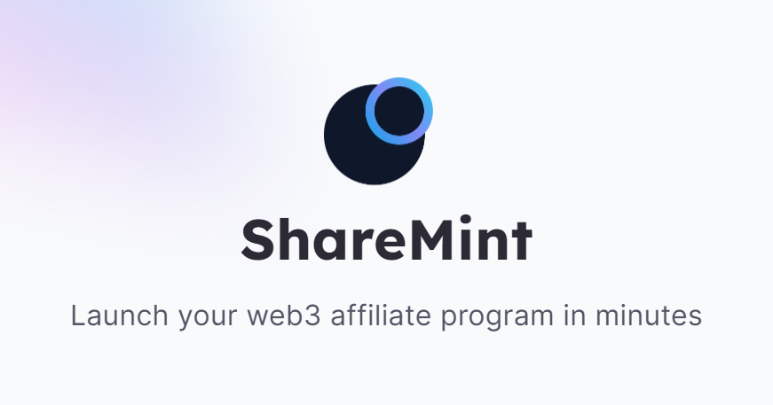

# 👋 Introduction

<figure><figcaption></figcaption></figure>

ShareMint makes it easy for you to launch an affiliate or referral marketing program for your web3 project. Reward your most loyal community members and promoters for the value they generate.


ShareMint demo


## Overview

ShareMint is a web3 affiliate and referral marketing that covers all your needs when it comes to quickly setting up your own referral program. We also help you connect with a network of top partners including web3 communities, influencers, newsletters and publishers.

Whether you're a DeFi protocol, web3 game, NFT mint, or web3 SaaS ShareMint will help you launch your referral program in minutes.

We're here to help you grow and maximise the power of your community and external partners.

A strong referral and affiliate program is key to incentivising people to share your project. But web2 affiliate platforms don't cater to web3 needs. Web2 platforms don't understand wallet addresses, on-chain activity, or how to pay out affiliates in crypto. This is where ShareMint comes in to help.

We offer a vast array of features with deep levels of customisations to help you launch your referral program. ShareMint supports Ethereum, Polygon, Binance Smart Chain, Arbitrum, Optimism, Base, Solana and every EVM chain.

[Launch a web3 referral program on Ethereum](https://blog.sharemint.xyz/launch-web3-referral-program-on-ethereum)

<figure><figcaption></figcaption></figure>

## Quick links


[what-we-do.md](overview/what-we-do.md)



[features.md](overview/features.md)


## Get Started

We've put together some helpful guides for you to get setup with our product quickly and easily.


[getting-started.md](fundamentals/getting-started.md)



[affiliate-sign-up-page.md](fundamentals/affiliate-sign-up-page.md)



[referee-sign-up-page.md](fundamentals/referee-sign-up-page.md)



[integrating-sharemint-into-your-website.md](fundamentals/integrating-sharemint-into-your-website.md)



[inviting-other-admins.md](fundamentals/inviting-other-admins.md)

