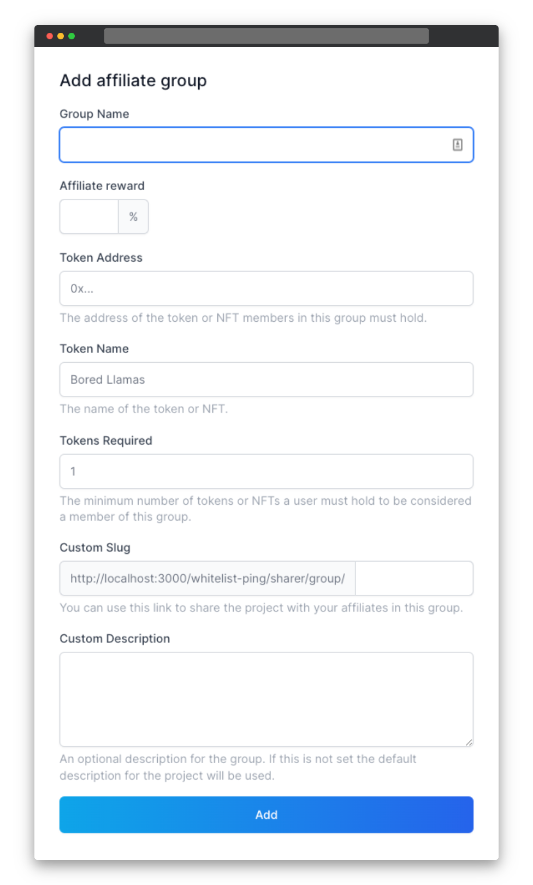

# 🎪 Affiliate Token Gating

You can offer different rewards to different affiliates using token gating. For example, if someone holds a Bored Ape, you might give them a 50% affiliate reward, whereas the standard tier is a 20% reward. This works great for existing communities where you can reward your early holders with higher rewards.

Token gating works for both regular tokens (ERC20) and NFTs (ERC721).

To add token gating to your project go to the project _Settings_ tab, and click _Add Group_ in the _Token Gating_ section.

You can also add affiliate groups behind a secret URL without the affiliate needing to hold any tokens. Anyone with the URL will be able to join the higher rewards tier.

<figure><figcaption></figcaption></figure>

**Group Name:** a name for the affiliate group. For example, Llama Holders.

**Affiliate Reward:** the revenue share an affiliate in the group will earn.

**Token Address:** the address of the ERC20 or ERC721 token to gate the affiliate page. You can find the address of a token on [Etherscan](https://etherscan.io). The token address will start with _0x_ and look something like _0x123abc123abc456..._ This field is optional_._ You can also create affiliate groups behind a secret URL where no token is required to gain access.

**Token Name:** the name of the token to display to users. For example, _Bored Ape Yacht Club_.

**Tokens Required:** how many tokens a holder must own to gain access. The default is one token.

**Custom Slug:** if set we will create a dedicated URL where token holders can sign up. They will also be able to sign up via the standard affiliate sign-up page and if we see they are holding tokens that enable higher rewards we will display a message to them to let them know.

**Custom Description:** a custom message on the dedicated page for this affiliate group. If no custom description is set then the default description for the project is used.

