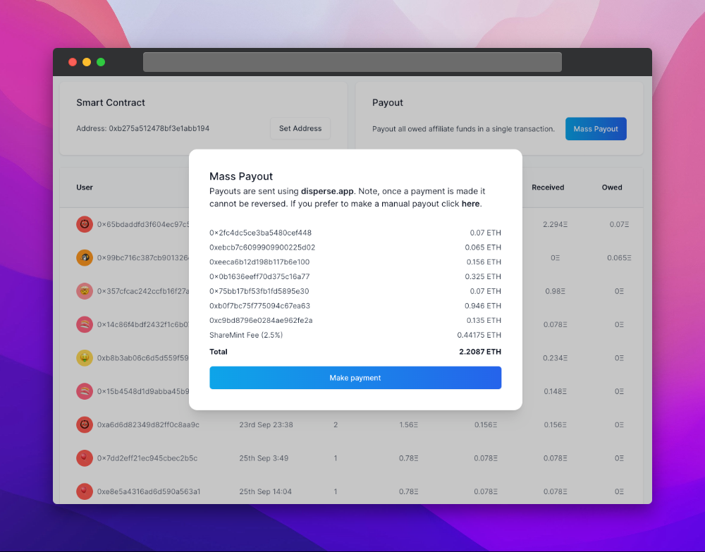

# ✨ Features

## On-Chain Analytics

We make it easy for you and your affiliates to understand exactly who your users are. Easily understand their past on-chain activity.

<figure><figcaption></figcaption></figure>

## One-Click Payouts

When it's time to pay out your affiliates you can do so in the click of a button. We make it easy to keep track of exactly who you have and haven't paid.

<figure><figcaption></figcaption></figure>

## NFT Allowlists

Run your allowlist via ShareMint or our HeyMint integration. Reward affiliates for inviting others to the allowlist and pay them on mint day.

## Token Gating

Token gate your affiliate program or offer higher rewards to token holders from specific communities.

## Affiliate Marketplace

Publish your project in our affiliate marketplace further boost your project via our affiliate network.

<figure><figcaption></figcaption></figure>
